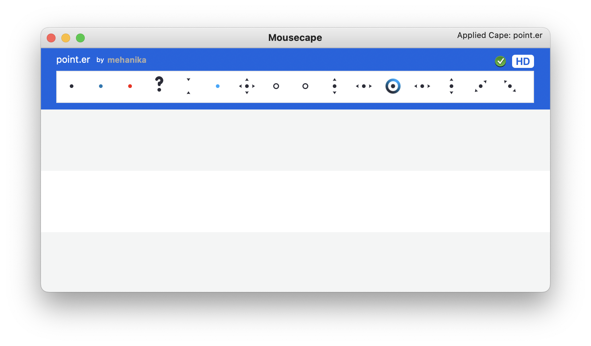

# point.er

### Cursor cape for *Mousecape* app

### How to setup this cursor to your mac?

- Install *Mousecape* app and go thru setup guide. You can downloaad it [here](https://github.com/alexzielenski/Mousecape) in **Releases** section.

- Download cape (cursor) [here](https://github.com/mehanika-prog/point.er/releases/tag/v1.0).
- In *Mousecape* app press `Cmd + O` and select downloaded file to import. After that you can delete original file.
- Select imported profile and press `Cmd + Enter`.
- Done

### Thanks

- [Alex Zielenski](https://github.com/alexzielenski), [Justin Ayles](https://github.com/justin0a0), [Boris Verkhovskiy](https://github.com/verhovsky) for awsome Cursor Manager for OSX.

- [Darques](https://boosty.to/i.darques) for cursor itself.